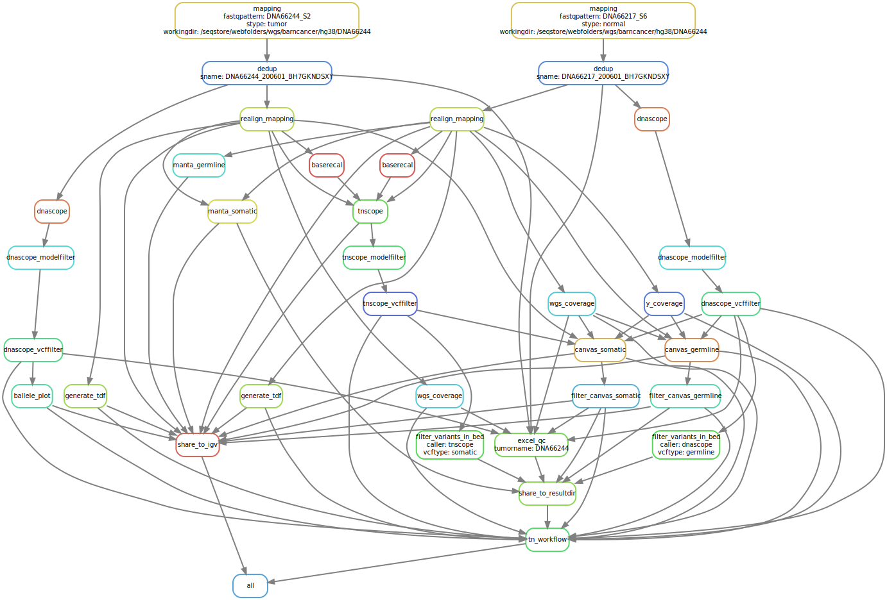

# The WGS Somatic Pipeline

DAG of pipeline at 2020-10-19 (upload to ingenuity rule is not activated currently)

### Needs a cool name

Ideas:

Just anothEr Wholegenome aNalysiS -- JEWNS

WOPR - junior

## General description 

Pipeline started out as a giant shell-script developed specifically for analysing neuroblastoma WholeGenomeSequenced samples in stockholm for Tommy Martinssons research group. Contact: Susanne Fransson (susanne.fransson@clingen.gu.se)

Pipeline was converted to Snakemake and updated in various ways, including a transition from hg19 to hg38 as a reference genome in conjunction with the project from BarncancerFonden in association with Genomic Medicine Sweden. Clinical Genomics Göteborg has had a bioinformatician employed in this project at 80% (of FTE).

The pipeline takes as input-data fastqfiles from a TUMOR and a NORMAL sample and generates a group of result and QC-files. The results contain Somatic AND Germline variantcalls of SNVs and InDels, as well as Structural Variants (SVs) and Copy Number Variants (CNVs) -- to provide the possibility of discovering both cancer pre-disposition variants but with a primary focus towards acquired mutations. 

### How to run:

Need to be on medair because python environment is hard-coded in launch_snakemake.py, also some tools in the snakemake workflow is hardcoded to install-locations on medair, and finally some dependencies such as references and databases are on medair.

> \#!/apps/bio/software/anaconda2/envs/wgs_somatic/bin/python

If you are on medair you should be able to just pull down this repository, and install singularities with the recipes in the singularity-dir (or simply copy from an existing repo).

Or you can just use an already set-up repository! Such as here:
`/apps/bio/repos/wgs_somatic`

Use "launch_snakemake.py" like this:

`./launch_snakemake.py --runnormal 200616_A00689_0144_BHFNK2DSXY --runtumor 200616_A00689_0144_BHFNK2DSXY --outputdir /seqstore/webfolders/wgs/barncancer/hg38/DNA66246 --normalsample DNA66245 --normalfastqs /seqstore/hcp_backed_up_data/local_wgs/barncancer/DNA66245 --tumorsample DNA66246 --tumorfastqs /seqstore/hcp_backed_up_data/local_wgs/barncancer/DNA66246 --igvuser barncancer_hg38 --hg38ref yes`

Runnormal and runtumor is only used to create a unique samplename based on the sequencing run the data comes from. Could probably be done in a better way.

### Goal:

* Have a high quality analysis of all types of genetic abberations (starting with SNVs and InDels, CNVs and SVs). 
* Which is fast (because some of these samples can help treatment of urgent pediatric cases). 
* Automated and connected to hospital systems so that it is not relied upon bioinformatician working-hours.
* Packaged into Singularities so that it can in the future be run on a cloud-platform like AWS.
* Connected to HCP to upload results (and download data for analysis?).
* Robust and well-documented to fit into the clinical requirements.

### Status (2020-10-19):

#### Reference genome

Currently operational on hg38 reference genome. Maybe hg19 still works but it has not been tested since the hg38 transition, possible that something has been broken. But the plan is to run this pipeline on hg38 in the immediate future, so maybe compatability with hg19 can be ensured later, or upon request.

#### Validation and optimisation:

##### Germline calling:
* SNVs and InDel calling with DNAscope (was validated through WOPR in hg19, but not on hg38)
* CNVs -- Canvas 
* SVs -- Manta

##### Somatic calling:
* SNVs and InDel calling with TNscope and custom Bcftools filters. Optimised against artificial truthset by mixing coriell samples (see wiki)
* CNVs -- Canvas
* SVs -- Manta

#### Code structure and organisation of dependencies

Most of the pipeline is packaged in Singularities, Sentieon and Canvas (Sentieon is majority of pipeline).
The remaining rules relies primarily on small python scripts, bcftools and Manta. Should not be too difficult to package these into singularities as well.

#### Validation project GMS - BT

* Analyse all samples in the project with hg38 (nearly done)
* Calculate sensitivity and precision with artificial truthset (nearly done)

